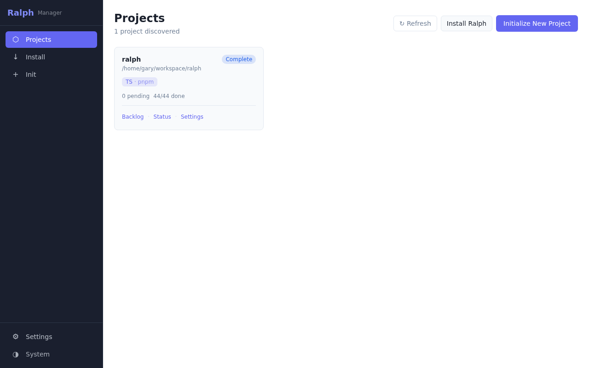
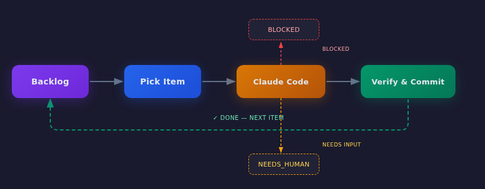
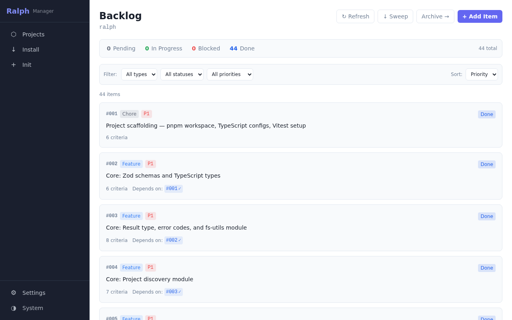
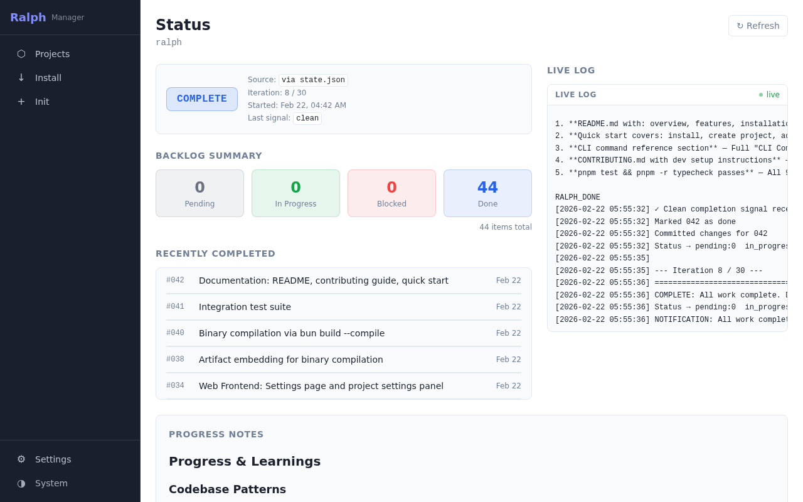

# Rauf

**Autonomous coding loops, managed.**

[](LICENSE)


Rauf installs, manages, and monitors AI coding loops across your local projects. Define a backlog, start the loop, and let [Claude Code](https://docs.anthropic.com/en/docs/claude-code) ship work items autonomously — with full visibility through a CLI and web dashboard.

<p align="center">
  
</p>

> **Self-hosted from day one.** Rauf built itself: 44 backlog items, each implemented, verified, and committed by its own loop. The screenshots below are rauf managing rauf.

---

## How It Works

<p align="center">
  
</p>

1. **Backlog** — You define work items with titles, priorities, and acceptance criteria
2. **Pick** — The loop runner selects the next pending item by priority (dependency-aware)
3. **Claude Code** — A fresh Claude Code session reads the item, implements changes, and runs verification
4. **Verify & Commit** — If all criteria pass, changes are committed and the loop advances

Each iteration produces one of three exit signals:

| Signal             | Meaning                            | What happens                       |
| ------------------ | ---------------------------------- | ---------------------------------- |
| `RAUF_DONE`        | All acceptance criteria passed     | Item marked done, loop continues   |
| `RAUF_BLOCKED`     | Missing dependency or unclear spec | Item paused, loop retries or skips |
| `RAUF_NEEDS_HUMAN` | Requires a decision or API key     | Loop pauses for human input        |

---

## Features

- **Auto-detect & install** — Detects Node.js, Python, Go, Rust stacks and deploys loop artifacts in one command
- **Greenfield init** — Scaffold a new project with git, CLAUDE.md, backlog, and loop infrastructure
- **Structured backlog** — JSON-based task queue with priorities, types, acceptance criteria, and dependencies
- **Real-time status** — Loop state derived directly from `state.json` with log-parsing fallback
- **Web dashboard** — React SPA with project cards, backlog management, live log streaming via SSE
- **Full CLI** — Every dashboard action available headless for scripting and CI
- **Single binary** — Compiles to one executable via `bun build --compile` (CLI + server + frontend + templates)
- **Self-contained projects** — Installed projects work standalone, no rauf manager required

---

## Install

Self-contained binaries are published with every release — no Bun or Node needed on the target machine. Downloads are verified against the release's `SHA256SUMS` before installing.

**Linux / macOS:**

```bash
curl -fsSL https://raw.githubusercontent.com/garygentry/rauf/main/scripts/install-binary.sh | bash
```

**Windows (PowerShell):**

```powershell
irm https://raw.githubusercontent.com/garygentry/rauf/main/scripts/install-binary.ps1 | iex
```

Set `RAUF_VERSION=v0.3.0` (or any tag) to install a specific release instead of latest.

> **macOS note:** the darwin binaries are unsigned in v1. Binaries installed via the `curl` one-liner are normally **not** quarantined, but if Gatekeeper blocks a binary downloaded through a browser or Finder, run `xattr -d com.apple.quarantine ./rauf` (or right-click → Open once). See [Releasing & Installing](docs/RELEASING.md) for details.

---

## Quick Start

**Prerequisites:** [Bun](https://bun.sh/) 1.0+, [Claude Code](https://docs.anthropic.com/en/docs/claude-code) CLI, Git

```bash
# Clone and build
git clone https://github.com/your-org/rauf.git
cd rauf && pnpm install && pnpm build

# Install rauf into an existing project
rauf install ~/workspace/my-project --yes

# Add a work item
rauf backlog add ~/workspace/my-project \
  --title "Add user authentication" \
  --type feature --priority 1 \
  --ac "Login endpoint returns JWT" \
  --ac "pnpm test passes"

# Start the loop
rauf loop run ~/workspace/my-project
```

---

## Web Dashboard

```bash
rauf server start     # http://localhost:5173
```

**Backlog management** — Add, edit, prioritize, and sweep items. Filter by status, type, or priority.

<p align="center">
  
</p>

**Status monitoring** — Live loop state, iteration counts, recent completions, and log streaming.

<p align="center">
  
</p>

---

## CLI

### Project Setup

```bash
rauf install <path> [--yes]              # Install into existing project
rauf init <path> --name --stack --seed   # Scaffold new project
rauf update <path> [--yes]               # Update rauf artifacts
rauf uninstall <path> [--yes]            # Remove rauf from project
```

### Backlog

```bash
rauf backlog list <path>                 # List items (--status, --type filters)
rauf backlog add <path> --title --ac     # Add item with acceptance criteria
rauf backlog edit <path> <id>            # Edit item fields
rauf backlog delete <path> <id>          # Delete item
rauf backlog show <path> <id>            # Show item details
rauf backlog sweep <path> --yes          # Archive completed items
```

### Loop

```bash
rauf loop run <path>                     # Run loop directly (no server)
rauf loop start <path>                   # Start loop via server (auto-starts daemon)
rauf loop stop <path>                    # Stop a running loop
rauf loop follow <path>                  # Stream loop events in terminal
```

### Monitoring

```bash
rauf status <path>                       # Loop state + backlog summary
rauf log <path> [--follow]               # View or tail loop log
rauf progress <path>                     # View accumulated learnings
```

### Server

```bash
rauf server start [--daemon] [--port N]  # Start web dashboard
rauf server stop                         # Stop server
rauf server status                       # Show server status
```

**Global flags:** `--json` `--no-color` `--quiet` `--root <path>`

---

## Project Structure

```
rauf/
├── packages/core/     Shared business logic (zero deps on cli/web/loop)
├── packages/loop/     Loop runner engine (LoopRunner, events, claude process)
├── packages/cli/      CLI tool
├── packages/web/      Hono API + React frontend
├── artifacts/         Template files installed into target projects
└── docs/              Architecture and specification documents
```

## Documentation

| Document                                    | Description                                      |
| ------------------------------------------- | ------------------------------------------------ |
| [Architecture](docs/ARCHITECTURE.md)        | System design, data flow, component boundaries   |
| [Schemas](docs/SCHEMAS.md)                  | All TypeScript types and JSON schemas            |
| [Core Spec](docs/SPEC-CORE.md)              | Core package logic and algorithms                |
| [CLI Spec](docs/SPEC-CLI.md)                | CLI commands, flags, and behavior                |
| [Web Spec](docs/SPEC-WEB.md)                | API endpoints and frontend architecture          |
| [Artifacts Spec](docs/SPEC-ARTIFACTS.md)    | Template files and installation process          |
| [Releasing & Installing](docs/RELEASING.md) | Release pipeline, one-time setup, binary install |

## Contributing

See [CONTRIBUTING.md](CONTRIBUTING.md) for the full guide. The essentials:

```bash
pnpm install        # Install dependencies
pnpm test           # Run tests (vitest)
pnpm typecheck      # TypeScript strict mode
pnpm lint           # ESLint
```

## License

[MIT](LICENSE)
