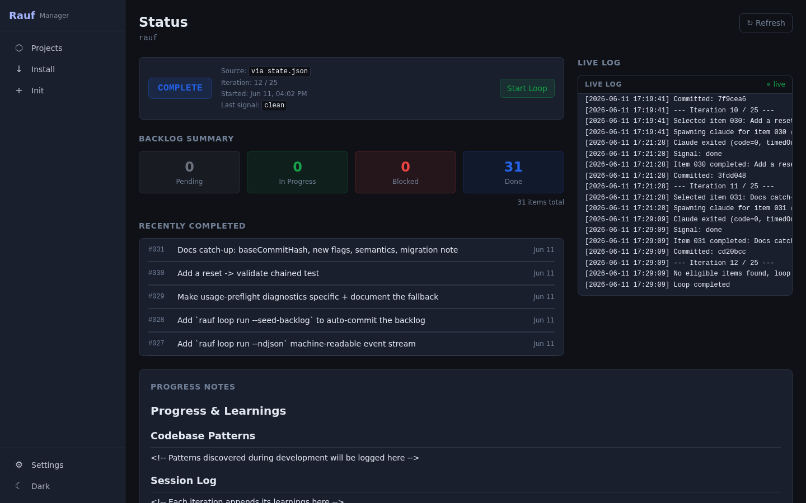

# Rauf

**Autonomous coding loops, managed.**

[](LICENSE)
[](https://github.com/garygentry/rauf/releases)

Rauf installs, manages, and monitors AI coding loops across your local projects. Define a backlog, start the loop, and let [Claude Code](https://docs.anthropic.com/en/docs/claude-code) ship work items autonomously — with full visibility through a CLI and web dashboard.

<p align="center">
  
</p>

> **Self-hosted from day one.** Rauf built itself — every backlog item in this repo was implemented, verified, and committed by its own loop. The screenshots below are rauf managing rauf.

---

## How It Works

<p align="center">
  
</p>

1. **Backlog** — You define work items with titles, priorities, and acceptance criteria
2. **Pick** — The loop runner selects the next pending item by priority (dependency-aware)
3. **Claude Code** — A fresh Claude Code session reads the item, implements changes, and runs verification
4. **Verify & Commit** — If all criteria pass, changes are committed and the loop advances

Each iteration produces one of three exit signals:

| Signal             | Meaning                            | What happens                       |
| ------------------ | ---------------------------------- | ---------------------------------- |
| `RAUF_DONE`        | All acceptance criteria passed     | Item marked done, loop continues   |
| `RAUF_BLOCKED`     | Missing dependency or unclear spec | Item paused, loop retries or skips |
| `RAUF_NEEDS_HUMAN` | Requires a decision or API key     | Loop pauses for human input        |

---

## Features

- **Auto-detect & install** — Detects Node.js, Python, Go, Rust stacks and deploys loop artifacts in one command
- **Greenfield init** — Scaffold a new project with git, CLAUDE.md, backlog, and loop infrastructure
- **Structured backlog** — JSON-based task queue with priorities, types, acceptance criteria, and dependencies
- **Real-time status** — Loop state derived directly from `state.json` with log-parsing fallback
- **Web dashboard** — React SPA with project cards, backlog management, live log streaming via SSE
- **Full CLI** — Every dashboard action available headless for scripting and CI
- **Single binary** — Compiles to one executable via `bun build --compile` (CLI + server + frontend + templates)
- **Self-contained projects** — Installed projects work standalone, no rauf manager required

---

## Multi-agent / feature-forge

Rauf is the default loop runner for [feature-forge](https://github.com/garygentry/feature-forge),
an agent-agnostic spec-and-backlog pipeline that runs on Claude, Codex, Copilot, Cursor, and
Gemini. feature-forge hands its generated backlog to a conforming runner; when no runner is
configured it defaults to rauf. See feature-forge's README for the cross-agent install story and
its per-agent setup docs.

---

## Install

**Prerequisites:** [Claude Code](https://docs.anthropic.com/en/docs/claude-code) CLI and Git (rauf spawns a Claude Code session each iteration and commits the result). Building from source also needs [Bun](https://bun.sh/) 1.0+, [pnpm](https://pnpm.io/) 9+, and Node.js ≥ 22.

### Via npm

The quickest way to get `rauf` is from npm — no clone, no build:

```bash
npm install -g @garygentry/rauf   # the installed command is still `rauf`
npx @garygentry/rauf status .      # or one-off, no install
```

The package is scoped (`@garygentry/rauf`) because the bare `rauf` name is blocked by npm's
name-similarity filter; the installed command remains `rauf`. The npm launcher fetches the
matching self-contained binary for your platform on first run.

### From source

Building from source gives you the current version (it may run ahead of the latest npm release):

```bash
git clone https://github.com/garygentry/rauf.git
cd rauf
pnpm install && pnpm build
bash scripts/install-global.sh   # symlinks `rauf` into ~/.local/bin
rauf version                     # verify (~/.local/bin must be on your PATH)
```

### Prebuilt binary (optional)

Each tagged release also publishes self-contained binaries (no Bun/Node on the target machine), verified against the release's `SHA256SUMS`. This installs the **latest published release**, which may lag the source tree:

```bash
# Linux / macOS
curl -fsSL https://raw.githubusercontent.com/garygentry/rauf/main/scripts/install-binary.sh | bash
```

```powershell
# Windows (PowerShell)
irm https://raw.githubusercontent.com/garygentry/rauf/main/scripts/install-binary.ps1 | iex
```

Set `RAUF_VERSION=<tag>` to pin a specific release instead of latest. macOS binaries are unsigned; if Gatekeeper blocks one downloaded via a browser, run `xattr -d com.apple.quarantine ./rauf`. See [Releasing & Installing](docs/RELEASING.md) for details.

---

## Quick Start

Once `rauf` is on your `PATH` (see [Install](#install) above):

```bash
# Install rauf into an existing project
rauf install ~/workspace/my-project --yes

# Add a work item
rauf backlog add ~/workspace/my-project \
  --title "Add user authentication" \
  --type feature --priority 1 \
  --ac "Login endpoint returns JWT" \
  --ac "pnpm test passes"

# Start the loop
rauf loop run ~/workspace/my-project
```

New to rauf? The [Your First Loop](https://garygentry.github.io/rauf/getting-started/your-first-loop/) tutorial walks through this end to end.

---

## Web Dashboard

```bash
rauf server start     # http://localhost:5173
```

**Backlog management** — Add, edit, prioritize, and sweep items. Filter by status, type, or priority.

<p align="center">
  
</p>

**Status monitoring** — Live loop state, iteration counts, recent completions, and log streaming.

<p align="center">
  
</p>

---

## CLI

### Project Setup

```bash
rauf install <path> [--yes]              # Install into existing project
rauf init <path> --name --stack --seed   # Scaffold new project
rauf update <path> [--yes]               # Update rauf artifacts
rauf uninstall <path> [--yes]            # Remove rauf from project
```

### Backlog

```bash
rauf backlog list <path>                 # List items (--status, --type filters)
rauf backlog add <path> --title --ac     # Add item with acceptance criteria
rauf backlog edit <path> <id>            # Edit item fields
rauf backlog delete <path> <id>          # Delete item
rauf backlog show <path> <id>            # Show item details
rauf backlog sweep <path> --yes          # Archive completed items
```

### Loop

```bash
rauf loop run <path>                     # Run loop directly (foreground, no server)
rauf loop run <path> --detached          # Run loop detached (server-owned, auto-starts daemon)
rauf loop stop <path>                    # Stop a detached/server-owned loop
rauf follow <path>                       # Stream loop events in terminal (top-level verb)
```

### Monitoring

```bash
rauf status <path>                       # Loop state + backlog summary
rauf log <path> [--follow]               # View or tail loop log
rauf progress <path>                     # View accumulated learnings
```

### Server

```bash
rauf server start [--daemon] [--port N]  # Start web dashboard
rauf server stop                         # Stop server
rauf server status                       # Show server status
```

**Global flags:** `--json` `--no-color` `--quiet` `--root <path>`

---

## Project Structure

```
rauf/
├── packages/core/     Shared business logic (zero deps on cli/web/loop)
├── packages/loop/     Loop runner engine (LoopRunner, events, claude process)
├── packages/cli/      CLI tool
├── packages/web/      Hono API + React frontend
├── artifacts/         Template files installed into target projects
└── docs/              Architecture and specification documents
```

<p align="center">
  
</p>

`core` never imports from `loop`, `web`, or `cli`; `loop` never imports from `web` or `cli`. See [Architecture](docs/ARCHITECTURE.md) for the full design.

## Documentation

📚 **[Full documentation site →](https://garygentry.github.io/rauf/)**

The site is the best starting point — a consumer-first journey from install to power use:

| Section                                                                            | What's there                                                                                              |
| ---------------------------------------------------------------------------------- | --------------------------------------------------------------------------------------------------------- |
| [Getting Started](https://garygentry.github.io/rauf/getting-started/installation/) | Installation, Your First Loop, and Core Concepts.                                                         |
| [Guides](https://garygentry.github.io/rauf/guides/monitoring/)                     | Monitoring, recovery, multi-backlog, the web dashboard, scripting & CI, customizing the agent, migrating. |
| [Reference](https://garygentry.github.io/rauf/spec-cli/)                           | CLI reference, machine surfaces & contract, and the backlog schema.                                       |

The canonical specs live under **Internals** on the site and as Markdown in [`docs/`](docs/):
[Architecture](docs/ARCHITECTURE.md) · [Schemas](docs/SCHEMAS.md) · [Core](docs/SPEC-CORE.md) ·
[CLI](docs/SPEC-CLI.md) · [Web](docs/SPEC-WEB.md) · [Artifacts](docs/SPEC-ARTIFACTS.md) ·
[Releasing](docs/RELEASING.md).

## Contributing

See [CONTRIBUTING.md](CONTRIBUTING.md) for the full guide. The essentials:

```bash
pnpm install        # Install dependencies
pnpm test           # Run tests (vitest)
pnpm typecheck      # TypeScript strict mode
pnpm lint           # ESLint
```

## License

[MIT](LICENSE)
