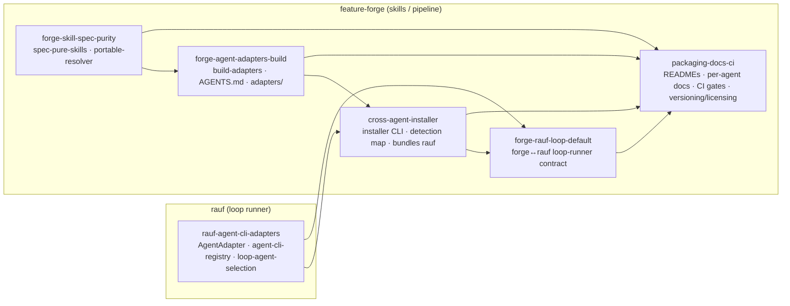

# Agent-Agnostic — Epic Architecture

This document describes the **assembled cross-agent system** produced by the
`agent-agnostic` epic: six pipeline-sized features, spanning two repos, that
together make both the **rauf** loop runner and the **feature-forge** skill/pipeline
repo operate under *any* coding agent — Claude Code, OpenAI Codex, GitHub Copilot,
Cursor, Gemini CLI — and be packageable and installable with minimal configuration.

It is written for someone who understands one piece and needs to see how the whole
fits. For any single feature's internals, follow the per-feature links.

## The goal, and the two flavours of "agent-agnostic"

The two repos carry different meanings of the same phrase:

- **rauf** is the loop runner. Here, agent-agnostic means a **coding-agent CLI
  adapter layer**: drive one loop iteration through any agent's CLI (`claude`,
  `codex`, `gemini`, `copilot`, `cursor`), not just `claude` — with the Claude path
  first-class and the default.
- **feature-forge** is the skills/pipeline collection. Here it gets the full
  treatment: a **spec-pure canonical core**, **generated per-agent adapters**, a
  canonical `AGENTS.md`, a **universal installer**, and hardened **packaging / docs
  / CI**.

Because the loop is integral to the feature-forge lifecycle, the two are tackled
together: feature-forge **defaults to rauf**, **ships rauf** in its multi-agent
install, and still **supports alternate runners**. Throughout, the Claude Code
plugin + marketplace path stays "preferred"; everything else is derived from a
single canonical source, never hand-edited divergently.

## The assembled pipeline



**Canon → generation → packaging → integration → capstone.** The spec-pure canon is
the single source of truth; the generator derives per-agent adapters from it; the
installer ships those adapters and bundles rauf; the loop integration wires forge to
default to rauf across agents; and the capstone documents and gates the whole thing.

## The six features

### 1. `rauf-agent-cli-adapters` — the runner seam (rauf)

Gives the loop runner a coding-agent CLI adapter layer. Introduces the
`AgentAdapter` abstraction (spawn the agent process, parse its stream, detect loop
signals), an **agent-cli registry** mapping each supported agent to its
invocation/stream/signal config plus a detection probe, and an agent-selection
surface (`--agent` / config) following the existing model-selection precedence. The
Claude path stays first-class and the default.

- **Exposes:** `AgentAdapter`, `agent-cli-registry`, `loop-agent-selection`.
- **Depends on:** nothing — this is the foundation everything cross-agent in the
  loop hangs off.
- Docs: [rauf-agent-cli-adapters](../rauf-agent-cli-adapters/README.md)

### 2. `forge-skill-spec-purity` — the canonical core (feature-forge)

Reduces every `skills/*/SKILL.md` to the spec-sanctioned frontmatter set
(`name` + `description`, plus optional `license`/`compatibility`/`metadata`/
`allowed-tools`) and relocates every vendor-only key out of the canonical body.
Replaces `${CLAUDE_PLUGIN_ROOT}` inside bundled scripts with a **portable multi-root
resolver**. This is the single source of truth from which all per-agent adapters are
later generated; it changes no per-agent output itself.

- **Exposes:** `spec-pure-skills`, `portable-skill-root-resolver`.
- **Depends on:** nothing.
- Docs: [forge-skill-spec-purity](../forge-skill-spec-purity/README.md)

### 3. `forge-agent-adapters-build` — the generator (feature-forge)

The canonical-to-per-agent build step: walks the spec-pure skills, parses
frontmatter, and emits per-agent artifacts (Codex mirror, Copilot copy, Cursor
`.mdc`, `gemini-extension.json`) into `adapters/`, each with a DO-NOT-EDIT header.
Authors the canonical `AGENTS.md`. Wires the CI **regenerate-and-diff** so generated
adapters can never drift from canon.

- **Exposes:** `build-adapters`, `AGENTS.md`, `adapters-output`.
- **Consumes:** `spec-pure-skills`, `portable-skill-root-resolver`.
- **Depends on:** `forge-skill-spec-purity`.
- Docs: [forge-agent-adapters-build](../forge-agent-adapters-build/README.md)

### 4. `cross-agent-installer` — the packaging seam (feature-forge, bundles rauf)

A cross-platform, zero-config CLI installer that detects installed coding agents by
probing their config dirs and installs the generated per-agent skills idempotently
(`add`/`update`/`uninstall`/`list`, `--dry-run`, `--global`, `--agent`, `--symlink`
opt-in / copy-by-default on Windows, `-y` for CI). It **bundles rauf** as the default
loop runner so a multi-agent install yields a working loop out of the box.

- **Exposes:** `cross-agent-installer-cli`, `agent-detection-map`.
- **Consumes:** `adapters-output`; provisions the published `rauf` bin externally.
- **Depends on:** `forge-agent-adapters-build`, `rauf-agent-cli-adapters`.
- Docs: [cross-agent-installer](../cross-agent-installer/README.md)

### 5. `forge-rauf-loop-default` — the forge↔rauf seam (feature-forge + rauf)

Wires `forge-5-loop` to **default to rauf** while still supporting alternate runners
through the existing tokenized `loopRunner` config, and threads a coding-agent
dimension through that seam. The whole feature is additive and presence-gated: it
activates only when a runner advertises `loopRunner.agentArgument`. Agent selection
flows forge → rauf with the precedence
`item (rauf) > run (forge --agent) > project (loopRunner.defaultAgent) > rauf default (claude-cli)`.

- **Exposes:** `forge-loop-runner-contract`.
- **Consumes:** `loop-agent-selection`, `cross-agent-installer-cli`.
- **Depends on:** `rauf-agent-cli-adapters`, `cross-agent-installer`.
- Docs: [forge-rauf-loop-default](../forge-rauf-loop-default/README.md)

### 6. `packaging-docs-ci` — the capstone (both repos)

Documents and CI-gates the assembled system. Rewrites both READMEs to lead with the
Claude-preferred marketplace install, a universal one-liner, and a per-surface
table; adds five per-agent setup docs. Stands up CI gates (plugin-validate, SKILL.md
schema, shellcheck/ruff, adapters regen-diff, version-sync, an OS-matrix installer
job, and an advisory trigger-accuracy eval); finalizes `.gitattributes`, MIT
licensing, version reconciliation (three fields → `0.10.0`), and CHANGELOGs.

- **Exposes:** `release-and-ci-gates`.
- **Consumes:** `cross-agent-installer-cli`, `forge-loop-runner-contract`,
  `adapters-output`, `spec-pure-skills` — the things it documents and gates.
- **Depends on:** features 2, 3, 4, 5.
- Docs: [packaging-docs-ci](../packaging-docs-ci/README.md)

## How the contracts chain

The epic is acyclic; each feature consumes only its **direct** dependencies'
exposed contracts:

| Contract | Exposed by | Consumed by |
|---|---|---|
| `spec-pure-skills` | forge-skill-spec-purity | forge-agent-adapters-build, packaging-docs-ci |
| `portable-skill-root-resolver` | forge-skill-spec-purity | forge-agent-adapters-build |
| `adapters-output` | forge-agent-adapters-build | cross-agent-installer, packaging-docs-ci |
| `AgentAdapter` / `agent-cli-registry` | rauf-agent-cli-adapters | (rauf-internal; bundled by installer) |
| `loop-agent-selection` | rauf-agent-cli-adapters | forge-rauf-loop-default |
| `cross-agent-installer-cli` | cross-agent-installer | forge-rauf-loop-default, packaging-docs-ci |
| `forge-loop-runner-contract` | forge-rauf-loop-default | packaging-docs-ci |
| `release-and-ci-gates` | packaging-docs-ci | (terminal — the shippable surface) |

## End-to-end: what a user actually does

The assembled system collapses to a short user story:

```bash
# 1. Install the skills onto every detected agent (Claude preferred via marketplace;
#    universal one-liner for the rest). The installer bundles rauf as the loop runner.
npx feature-forge install                 # or: /plugin install feature-forge@feature-forge

# 2. Run the forge pipeline on your agent of choice — spec-pure canon, per-agent adapters.
/feature-forge:forge-1-prd my-feature     # … through forge-2…forge-4

# 3. forge-5-loop hands the backlog to rauf (the default runner), driving the chosen agent.
#    Agent selection flows forge → rauf via the precedence above.
```

Every layer in that story is one feature: spec-pure canon (2) → generated adapters
(3) → installer (4) → forge↔rauf loop (5) → driven by rauf's adapter layer (1) — all
documented, gated, and packaged by the capstone (6).

## Cross-cutting invariants

- **Single source of truth, never hand-edited.** Canon lives in `skills/*/SKILL.md`;
  everything per-agent is generated. The regen-and-diff gate (feature 3, enforced by
  feature 6) makes drift impossible.
- **Spec-purity is load-bearing.** No installer, gate, schema, or version mechanism
  may reintroduce vendor keys or a `version` field into canonical skills. Feature 6's
  SKILL.md schema enforces this mechanically.
- **Presence-gated additivity.** The agent dimension (feature 5) vanishes for any
  runner that doesn't opt in — byte-identical to before.
- **Claude stays preferred.** The marketplace/plugin path is first-class; all other
  agents are derived from the same canon.
- **Two independent semver lines.** rauf and feature-forge version independently;
  there is no requirement they share a number.

## Status

All six features are **complete-for-orchestration**. This epic-level document was
synthesized at the capstone (`packaging-docs-ci`), the natural moment to describe the
assembled whole. The authoritative per-feature specs live under
`specs/agent-agnostic/<feature>/`; the epic narrative is `specs/agent-agnostic/EPIC.md`.
