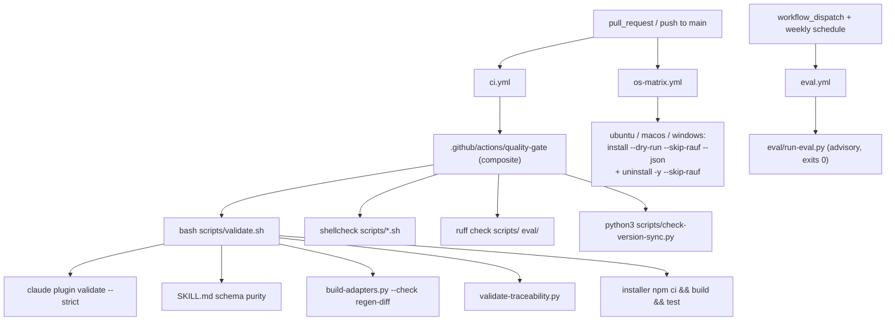
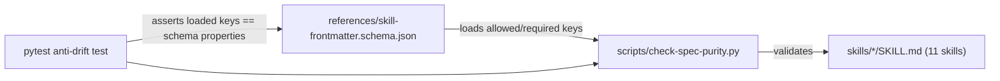

# Architecture

This feature has no module graph in the conventional sense — nothing imports it.
Its architecture is the **shape of the CI surface and the authoring artifacts**
across two repos, and the discipline that keeps CI and local development from
drifting. Read this document as "how the gates are wired and why."

## The two-repo reality

The `agent-agnostic` epic spans `rauf` (the loop runner, this repo) and
`feature-forge` (the skills/pipeline repo, `../feature-forge`). The capstone's
pipeline state lives **here** — `specs/agent-agnostic/packaging-docs-ci/` — but the
implementation edits files in **both** working trees. The split:

```
feature-forge/                          rauf/
  .github/                                .github/
    workflows/ci.yml          ┐            workflows/
    workflows/os-matrix.yml   │              ci.yml          (exists — pnpm gate)
    workflows/eval.yml        │ NEW          docs.yml        (exists — check:docs)
    actions/quality-gate/     ┘              npm-publish.yml (NEW — manual publish machinery)
  references/skill-frontmatter.schema.json  .gitattributes   (NEW)
  scripts/check-version-sync.py             README.md        (EDIT — cross-agent section)
  scripts/check-spec-purity.py (EDIT)       CHANGELOG.md     (EDIT)
  scripts/build-adapters.py    (EDIT)       package.json     (npm-publishability prep)
  ruff.toml  .shellcheckrc
  eval/run-eval.py + fixtures/
  docs/agents/{claude,codex,copilot,cursor,gemini}.md
  README.md  LICENSE  .gitattributes  CHANGELOG.md
```

Because rauf's loop runner owns the commit during an autonomous loop, the
feature-forge edits are staged/committed in feature-forge's own working tree via
the cross-repo loop technique used by sibling features. A feature-forge gate
failure blocks the **feature-forge** PR, not the rauf backlog item's local gate.

## The gate data flow

Three workflows, each triggered differently, each delegating to a single source of
truth rather than reimplementing logic in YAML.



### Why route through `validate.sh` (not YAML steps)

`validate.sh` is the aggregate gate feature-forge contributors already run locally.
Duplicating its steps in YAML would let CI and local drift — a green local run
could fail CI or vice-versa. So `ci.yml` is intentionally **two lines** (checkout +
`uses: ./.github/actions/quality-gate`), and the composite action's only job is to
provision tooling and then call the same scripts a developer runs. This mirrors
rauf's existing `ci.yml` → `quality-gate` → `pnpm gate` pattern.

## The composite-action pattern (shared CI, the pragmatic form)

REQ-CIINFRA-02 asks that shared gates be "factored as reusable workflows / composite
actions rather than duplicated." This is satisfied by **pattern-reuse**, not a
cross-repo reusable workflow:

- rauf's `.github/actions/quality-gate` runs `pnpm gate` (TypeScript-specific).
- feature-forge's `.github/actions/quality-gate` runs `validate.sh` + lint +
  version-sync (Python/shell-specific).

The two composite actions are **structurally parallel** — one entry point per repo
that runs the repo's canonical gate. True cross-repo factoring
(`uses: garygentry/rauf/.github/workflows/…`) was rejected: rauf's gate is not
transferable to feature-forge's stack, and extracting a public action repo is a
heavy lift for a P1 *SHOULD*. Parallel composites are the practical "factored, not
duplicated inline in every workflow."

## Blocking vs. advisory, and why each lives in its own workflow

- **`ci.yml`** — the fast deterministic gate. Runs on every `pull_request` and on
  `push` to `main`. Must complete in a few minutes (REQ-PERF-01), so it stays off
  the OS matrix.
- **`os-matrix.yml`** — the installer gate, split out because matrix jobs are
  slower. `fail-fast: false` so every OS reports independently. Blocking
  (REQ-CI-07 is P0), but its own required-check status can be tuned separately.
- **`eval.yml`** — advisory. `workflow_dispatch` + weekly `schedule`, **never**
  `pull_request`. The harness always exits 0 (a low score or an absent
  `ANTHROPIC_API_KEY` is not a failure). The weekly cadence bounds API cost.

## The spec-purity invariant, mechanically enforced

`forge-skill-spec-purity` established that canonical `skills/*/SKILL.md` carry only
the spec-sanctioned frontmatter keys. This capstone makes that invariant
**declarative and authoritative**:



The JSON Schema (`additionalProperties: false`, the 6-key allowed set, no `version`
key) is the single source of truth for *which keys are allowed*. `check-spec-purity.py`
loads that set instead of hard-coding it. The two checks JSON Schema can't express —
`name == <directory name>` and the `${CLAUDE_PLUGIN_ROOT}` / portable-prelude / size
rules — stay in Python. A pytest case asserts the checker's loaded set equals the
schema's `properties` keys, so the two can never drift.

This is why **the schema deliberately omits `version`**: versions live in the
per-repo manifests only (REQ-VER-03). A SKILL.md with a `version` key fails the
gate.

## Version reconciliation as a generator concern

Three feature-forge fields were desynced (`plugin.json 0.10.0` /
`marketplace.json 0.9.0` / `gemini-extension.json 0.0.0`). They are reconciled to
`0.10.0`, but **how** each is reconciled matters:

- `plugin.json` — already `0.10.0` (confirmed).
- `marketplace.json` — hand-edited (it is authored, not generated).
- `gemini-extension.json` — **regenerated, never hand-edited.** It carries a
  DO-NOT-EDIT header (REQ-MAINT-01), so the only sanctioned path is bumping the
  `GEMINI_EXTENSION_VERSION` constant in `scripts/build-adapters.py` and running
  the generator. The adapters regen-diff gate (REQ-CI-04) would otherwise catch a
  hand-edit as drift.

`check-version-sync.py` asserts the three fields are byte-equal and prints the
conflicting files+values on mismatch. `installer/package.json` is **excluded** — it
is a separately npm-published sub-package with its own release cadence.

## What this feature deliberately does *not* do

- **No live release.** No `npm publish` of rauf, no git tag/release cut. The
  `npm-publish.yml` workflow is `workflow_dispatch`-only machinery; rauf's
  `package.json` gets publishability metadata but no version change.
- **No new product features.** No new installer flags, adapter formats, or loop
  capabilities — it documents and gates the *existing* assembled system.
- **No blocking eval threshold.** Trigger-accuracy is advisory by design.
- **No relicensing churn.** A top-level MIT `LICENSE` per repo; no per-file SPDX
  sweep.

## Requirement traceability

The full requirement set lives in the PRD
(`specs/agent-agnostic/packaging-docs-ci/PRD.md`) and the implementation specs
(`00-`…`07-`). Cross-references in this doc use the same `REQ-*` ids so a reader can
jump from "why" (PRD) to "how" (this doc) to "where" (the files in
[README.md](./README.md#where-the-artifacts-live)).
