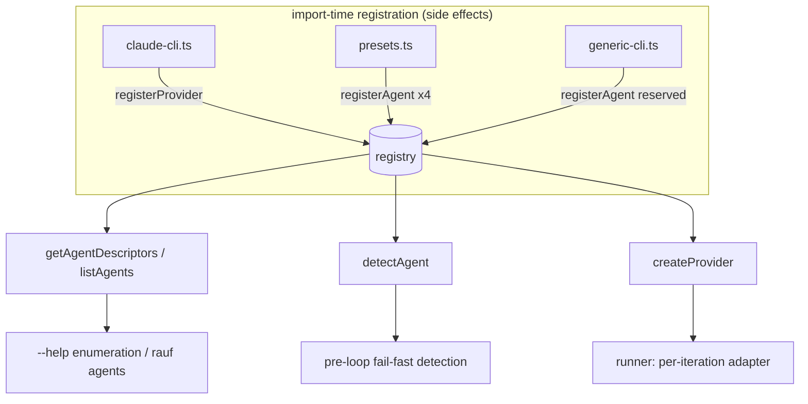

# Architecture

This document explains how the agent-agnostic loop is built: the registry that makes
agents enumerable and probeable, the single engine that drives every non-Claude CLI, how
the runner routes an iteration through the selected agent, and the two cross-cutting
contracts that keep multi-agent runs correct — the child-env thread (SC-2) and signal
neutralization (REQ-SEC-02).

## The adapter seam

Every agent implements one interface, `LLMProvider` (aliased `AgentAdapter`):

```typescript
interface LLMProvider {
  readonly id: string;
  readonly displayName: string;
  execute(prompt: string, options: ExecuteOptions): Promise<Result<ExecutionResult>>;
  checkUsage?(): Promise<UsageLimitResult>; // optional
  validateCredentials(): Result<void>;
  dispose?(): Promise<void>; // optional
}
```

Two adapters back the shipped agents:

- **`ClaudeCliProvider`** (`claude-cli`) — the pre-existing Claude adapter. Stream-parses
  `stream-json`, implements `checkUsage` (Anthropic rate limits), and validates OAuth
  credentials.
- **`CliAgent`** — one config-driven engine behind _every_ other agent. It implements only
  `id`, `displayName`, `execute`, and `validateCredentials`. The two omissions are
  load-bearing:
  - **No `checkUsage`** — the runner gates _all_ Anthropic usage handling on `checkUsage`
    being defined, so a `CliAgent` never triggers Claude-specific rate-limit logic
    (REQ-USAGE-02).
  - **No `dispose`** — nothing persistent to release.

`CliAgent` always runs in **plain-text mode**: the `ExecutionResult` it returns leaves
`reconstructedText`, `parsedSignal`, and `progressEvents` unset, so token/tool telemetry
is _gracefully absent_ rather than an error (REQ-OBS-02).

## The descriptor registry

The registry holds two maps keyed by agent id:

- a **factory map** (`id → ProviderFactory`) used by `createProvider` to construct an
  adapter on demand, and
- a **descriptor map** (`id → AgentDescriptor`) used to enumerate and probe agents
  _without_ constructing anything or reading run config.



Two write paths populate the registry, both idempotent (last write wins):

- **`registerProvider(id, factory)`** — the _existing_ surface, unchanged signature. For
  back-compat it now also **synthesizes** a default descriptor (id used for `displayName`
  and `binaryName`) so any legacy-registered provider stays enumerable and probeable
  without adopting the descriptor API. An explicit later `registerAgent` overwrites it.
- **`registerAgent(descriptor)`** — the descriptor-aware path. Populates _both_ maps.

Registration happens at import time via side-effect imports in `providers/index.ts`
(`claude-cli`, `presets`, `generic-cli`), so importing the package barrel registers the
default agent, the four presets, and the reserved `generic-cli` descriptor.

### Detection (availability probing)

`AgentDescriptor.detect` answers "is this agent usable here?" without spawning the agent.
The default probe is a PATH resolution of `binaryName` — a stat-style `which`, consistent
with the project rule that _status reads files, not subprocesses_. Two descriptors
override it:

- `claude-cli` uses its credential check.
- `generic-cli` has no fixed binary, so it reports "configurable" when no `providerConfig`
  is supplied, and PATH-probes the configured binary when one is.

`detectAgent(id)` and `listAgents()` **never throw** — an unknown or unavailable agent is
returned as _data_ (`available: false` with a human-readable `detail`), never an
exception. This is what lets `rauf agents` always render a full table.

## The `CliAgent` engine and `CliAgentConfig`

`CliAgentConfig` is plain data — the entire knowledge of "how to invoke agent X":

| Field               | Role                                                         |
| ------------------- | ------------------------------------------------------------ |
| `binary`            | Executable to spawn                                          |
| `buildArgs(ctx)`    | Subcommand/positional args (no prompt, no model flags)       |
| `promptDelivery`    | `"stdin"` \| `"arg"` \| `"file"`                             |
| `nonInteractive`    | Flags that force auto-approve, always appended (REQ-EXEC-01) |
| `modelFlag?(model)` | Resolved model → argv flags; omitted ⇒ agent's default model |
| `env?`              | Static env overrides, merged under `options.env`             |

`CliAgent.execute` assembles argv as `buildArgs(ctx) + nonInteractive + modelFlag(model)`,
delivers the prompt per `promptDelivery`, and spawns via `spawnProcessGroup` with
`cwd === ROOT_DIRECTORY` (the REQ-SEC-01 confinement boundary, passed explicitly). For
`promptDelivery === "file"`, the prompt is written to a collision-resistant temp file
_inside_ the sandbox cwd and unlinked in a `finally` block, so it never escapes rauf's
path-sandboxing and never leaks on failure.

### Presets and `generic-cli`

The four presets are `CliAgentConfig` literals:

| id        | binary         | delivery | non-interactive     | model flag    |
| --------- | -------------- | -------- | ------------------- | ------------- |
| `codex`   | `codex`        | `arg`    | `--full-auto`       | `--model <m>` |
| `gemini`  | `gemini`       | `stdin`  | `--yolo`            | `-m <m>`      |
| `copilot` | `copilot`      | `stdin`  | `--allow-all-tools` | `--model <m>` |
| `cursor`  | `cursor-agent` | `arg`    | `--force`           | `--model <m>` |

> Note `cursor`'s binary (`cursor-agent`) deliberately differs from its agent id
> (`cursor`). These flags are best-known defaults (epic OQ-2) — correct them via
> `generic-cli` config if an upstream CLI changes.

`generic-cli` is the reserved, configurable agent. `configToCliAgentConfig(id, raw)`
normalizes an untyped `providerConfig` record into a validated `CliAgentConfig`, returning
a `Result` so a malformed entry is an _expected error_, not a throw. Defaults: `args` →
`[]`, `promptDelivery` → `"stdin"`, `nonInteractive` → `[]`; an optional
`modelFlagTemplate` string becomes the `modelFlag`.

## Selection: precedence and the `agent` alias

`resolveAgentId` is pure and total — it never throws, never does I/O, and always returns a
non-empty id by collapsing four optional layers (highest wins):

```
itemProvider → runProvider → projectProvider → globalProvider → DEFAULT_AGENT_ID
   (backlog)     (--agent)     (.rauf.json)    (~/.rauf/config)   ("claude-cli")
```

It does **not** validate that the id is _known_ — that is the consumer's job
(`createProvider` / `detectAgent`), keeping the resolver registry-free.

`normalizeAgentAlias` folds the user-facing `agent` key onto the canonical `provider` key
**before** schema validation. If both are present, `provider` wins and a warning fires.
Because `@rauf/core` must not import `@rauf/loop`, the core load boundaries (backlog/config
readers) use a sibling **core-local `foldAlias`** family rather than importing
`normalizeAgentAlias`; the loop export remains the charter surface. Both enforce the same
rule, so wherever you write `agent`, it persists as `provider`.

## Runner wiring

The runner routes **both** execution paths (the work iteration and the review pass)
through `provider.execute` — there is no remaining `spawnClaude(` call site in the runner.
Per iteration it:

1. **Resolves** the agent id (`resolveAgentId`) and constructs/looks-up the adapter from a
   **per-id cache**, calling `dispose` on every exit.
2. **Emits** the real `provider.id` in `llm_spawned` / `llm_exited` events (so a `codex`
   run never mislabels itself `claude-cli`).
3. **Gates usage** only when the adapter defines `checkUsage`; for adapters without it, a
   literal "rate limit" string in output is _not_ misclassified as a usage limit.
4. **Runs the OAuth credential preflight only for `claude-cli`.**
5. **Threads `childEnv`** into `ExecuteOptions.env` (see below).

### Pre-loop fail-fast detection

Before iteration 1, the runner probes every _candidate_ agent (the ids reachable through
the selection layers). If the selected agent's CLI is unavailable, it **fails fast**: no
`state.json` is written, no backlog item is mutated, and the error names the missing agent
plus remediation and the supported ids — and it never silently falls back to Claude.

### SC-2 — the child-env contract

The runner's resolved `childEnv` (e.g. review-hook suppression like
`ENABLE_CODE_SECURITY_REVIEW=0`) must reach _every_ agent uniformly. The seam is
`ExecuteOptions.env`: the runner passes `childEnv` there, `ClaudeCliProvider.execute`
forwards it to `spawnClaude`, and `CliAgent.execute` merges it **over** the adapter's
static `CliAgentConfig.env`. Omitting it ⇒ the child inherits the parent env unchanged.
This is the SC-2 regression contract, anchored by tests in `runner.test.ts` and
`cli-agent.test.ts`.

### REQ-SEC-02 — signal neutralization

Agent output is untrusted text. A genuine rauf control signal (`RAUF_DONE`,
`RAUF_BLOCKED`, `RAUF_NEEDS_HUMAN`, `RAUF_REVIEW`) is a standalone final line; the same
token appearing _inline_ (e.g. quoted in prose) must not be mistaken for one.
`neutralizeForDetection` rewrites inline `RAUF_*` tokens (`_` → `·`) on non-signal lines
while preserving a legitimate final-line signal, and the runner applies it at **both**
pre-`parseSignal` sites (work iteration and review pass). Because plain-text `CliAgent`
output is not stream-parsed, this uniform neutralization is what keeps signal detection
robust across all agents.

## Observability

The loop's event stream is agent-agnostic: events carry the real `provider.id`. Telemetry
that only Claude's stream parser produces (token counts, tool-activity) is simply absent
for `CliAgent`-driven agents — consumers must treat those fields as optional (REQ-OBS-02).

## Further Reading

- [API Reference](./api-reference.md)
- [Adding an Agent](./guides/adding-an-agent.md)
