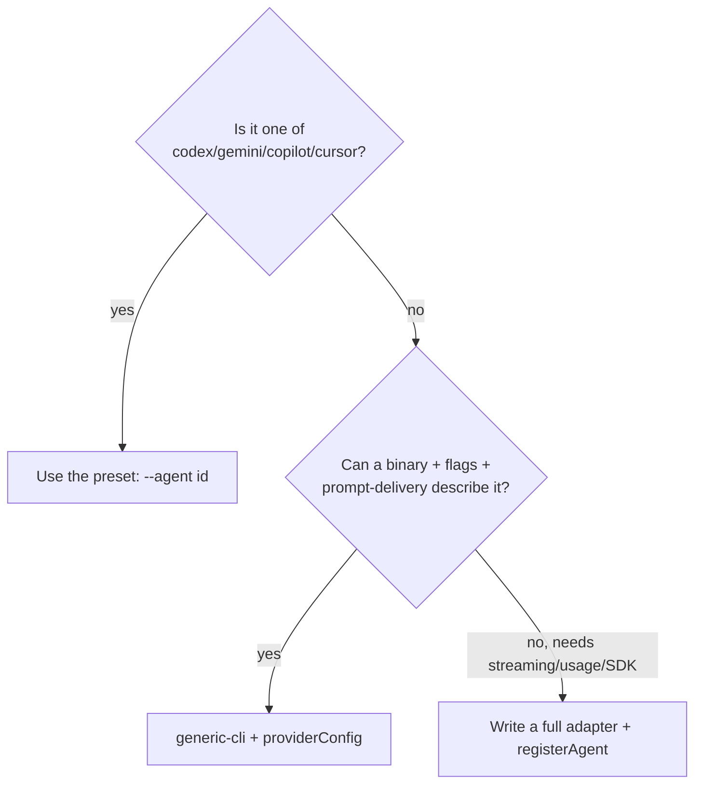

# Adding an Agent

There are three ways to drive a new coding-agent CLI from the rauf loop, in increasing
order of effort. Reach for the lightest one that works.



## Option 1 — a shipped preset

If the agent is `codex`, `gemini`, `copilot`, or `cursor`, you do nothing but select it.
The preset is already registered at import time.

```bash
rauf loop run . --agent codex
```

Confirm it's installed first:

```bash
rauf agents
```

If a preset's flags are stale (an upstream CLI changed its interface), don't fork the
code — override it with a `generic-cli` config (Option 2) using the same binary.

**`codex` has its own `providerConfig`.** Unlike the other presets, `codex` reads a typed
config block (sandbox mode, network access, approval policy, extra args) instead of requiring
the `generic-cli` escape hatch — select `--agent codex` and supply `providerConfig`:

```jsonc
// .rauf.json options.providerConfig, with provider: "codex"
{
  "sandboxMode": "workspace-write", // "read-only" | "workspace-write" | "danger-full-access"
  "networkAccess": true, // default true; set false to restore Codex's network-restricted default
  "approvalPolicy": "never",
  "extraArgs": [],
}
```

Network access is **on by default** (matching `claude-cli`'s unconditional trust posture) so
network-dependent work (installs, lockfiles, fetches) isn't falsely blocked by Codex's sandbox.
See `docs/SPEC-BACKLOG-TOOL-CONTRACT.md` §5.3 for the full field table.

## Option 2 — `generic-cli` (no code)

Use the reserved `generic-cli` agent to drive any CLI that fits the declarative shape:
a binary, some static args, a prompt-delivery method, non-interactive flags, and
(optionally) a model flag.

Select `generic-cli` and supply a `providerConfig`. The config is normalized by
`configToCliAgentConfig`, which accepts:

| Key                 | Default   | Meaning                                                    |
| ------------------- | --------- | ---------------------------------------------------------- |
| `binary` (required) | —         | Executable to spawn                                        |
| `promptDelivery`    | `"stdin"` | `"stdin"` \| `"arg"` \| `"file"`                           |
| `args`              | `[]`      | Static subcommand/positional args                          |
| `nonInteractive`    | `[]`      | Auto-approve flags, always appended                        |
| `modelFlagTemplate` | —         | String flag prepended before the model, e.g. `"--model"`   |
| `env`               | —         | Static env overrides (merged under the runner's child env) |
| `displayName`       | the id    | Human-readable name                                        |

For example, to drive a hypothetical `mytool` CLI invoked as
`mytool run --yes "<prompt>"`:

```jsonc
// providerConfig (supplied via the run marker / .rauf.json provider config)
{
  "binary": "mytool",
  "args": ["run"],
  "nonInteractive": ["--yes"],
  "promptDelivery": "arg",
  "modelFlagTemplate": "--model",
}
```

A missing/empty `binary` or an invalid `promptDelivery` is an _expected error_
(`VALIDATION_ERROR`) surfaced by the run, not a crash.

> **Prompt delivery picks the wiring:** `stdin` pipes the prompt to the child; `arg`
> appends it as the final argv element; `file` writes it to a temp file inside the sandbox
> cwd and passes the path (the engine cleans the file up afterward).

## Option 3 — a full adapter (code)

Write a real adapter only when the declarative `CliAgentConfig` can't express what the
agent needs — for example streaming output, usage/rate-limit reporting, or an SDK call
instead of a subprocess.

### 3a. Still a CLI, but you want a first-class preset

Add a `CliAgentConfig` literal to `PRESET_CONFIGS` (it's registered for you at import time
via `presets.ts`). This is the right move when the agent is a stable, broadly useful CLI
that deserves a short id and `--help` listing.

```typescript
// packages/loop/src/providers/presets.ts
{
  id: 'mytool',
  displayName: 'My Tool CLI',
  binary: 'mytool',
  promptDelivery: 'arg',
  buildArgs: () => ['run'],
  nonInteractive: ['--yes'],
  modelFlag: (m) => ['--model', m],
}
```

### 3b. Custom behavior — implement `LLMProvider` and `registerAgent`

```typescript
import { registerAgent, type LLMProvider } from "@rauf/loop";

class MyToolProvider implements LLMProvider {
  readonly id = "mytool";
  readonly displayName = "My Tool";
  async execute(prompt, options) {
    /* spawn / call SDK; return Result<ExecutionResult> */
  }
  validateCredentials() {
    /* return ok(undefined) or err(...) */
  }
  // Add checkUsage?() ONLY if this agent has Anthropic-style usage gating —
  // the runner keys all usage handling on its presence.
}

registerAgent({
  id: "mytool",
  displayName: "My Tool",
  binaryName: "mytool", // omit only if there is no fixed binary
  factory: () => new MyToolProvider(),
  // detect defaults to a PATH probe of binaryName; override for credential/config checks.
});
```

Place the `registerAgent` call in a module that's imported for its side effect from
`providers/index.ts`, mirroring `claude-cli` / `presets` / `generic-cli`.

## Contracts your adapter must honor

Whichever option you choose, the runner relies on these:

- **Child env (SC-2).** Honor `ExecuteOptions.env` — merge it over any static env so the
  runner's `childEnv` (e.g. review-hook suppression) reaches the agent. `CliAgent` already
  does this; a custom adapter must too.
- **Confinement (REQ-SEC-01).** Spawn with `cwd === ROOT_DIRECTORY`. `CliAgent` passes it
  explicitly; don't let a child escape the sandbox.
- **No usage misfire (REQ-USAGE-02).** Only implement `checkUsage` if the agent genuinely
  reports usage limits — its mere presence turns on usage gating.
- **Plain-text is fine (REQ-OBS-02).** If you don't produce stream telemetry, leave
  `reconstructedText` / `parsedSignal` / `progressEvents` unset; consumers treat them as
  optional. Signal detection still works because the runner neutralizes inline `RAUF_*`
  tokens before parsing (REQ-SEC-02).

## Verifying

```bash
rauf agents                       # is the new agent registered + available?
rauf loop run . --agent mytool    # drive a run
bash test-sandbox/verify.sh       # per-agent end-to-end sandbox assertions (manual; not in `pnpm gate`)
```

The sandbox ships plain-text mock agents (`test-sandbox/codex`, `gemini`, `copilot`,
`cursor-agent`, `mock-generic-agent.sh`) so you can exercise the wiring without installing
the real CLIs.
